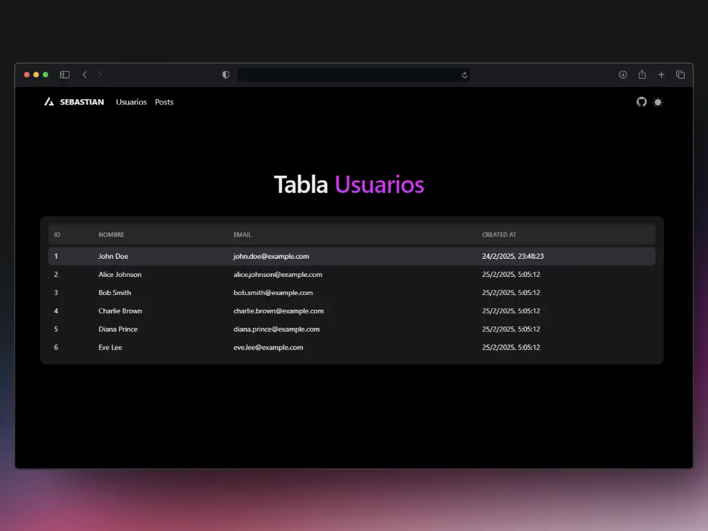
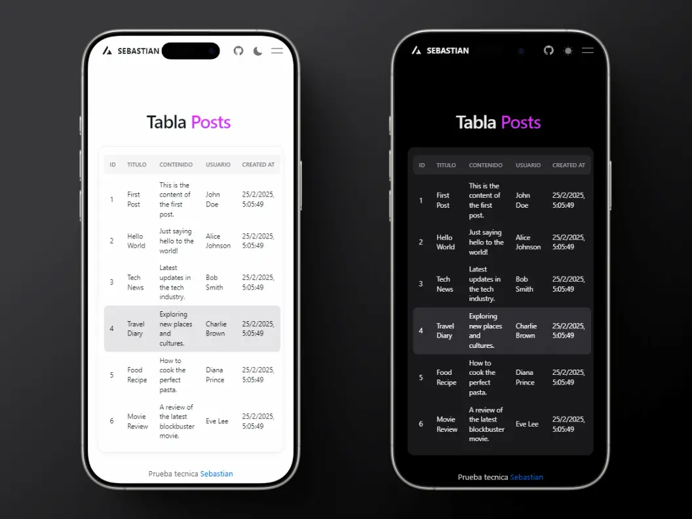

# Frontend para Prueba Técnica

Este proyecto es un frontend desarrollado con Vite, React, y TypeScript, utilizando Tailwind CSS para estilos y Framer Motion para animaciones. El frontend se conecta a un backend que proporciona endpoints para gestionar usuarios y posts.

## Capturas de Pantalla

### Tabla Usuarios



### Diseño Responsive




## Características

- **Vite**: Herramienta de construcción rápida para proyectos modernos de JavaScript.
- **React**: Biblioteca para construir interfaces de usuario.
- **TypeScript**: Lenguaje de programación que añade tipos estáticos a JavaScript.
- **Tailwind CSS**: Framework de CSS utilitario para diseñar rápidamente interfaces personalizadas.
- **HeroUI**: Componentes de interfaz de usuario accesibles y reutilizables.
- **Tailwind Variants**: Utilidades para manejar variantes de Tailwind CSS.
- **Framer Motion**: Biblioteca para animaciones en React.

## Requisitos

- Node.js (v14 o superior)

## Instalación

1. **Clonar el Repositorio**:
    ```bash
    git clone https://github.com/Tunnler/frontend-prueba-tecnica-ITE.git
    cd frontend-prueba-tecnica-ITE
    ```

2. **Instalar Dependencias**:
    ```bash
    npm install
    ```

## Ejecutar la Aplicación

```bash
npm run dev
